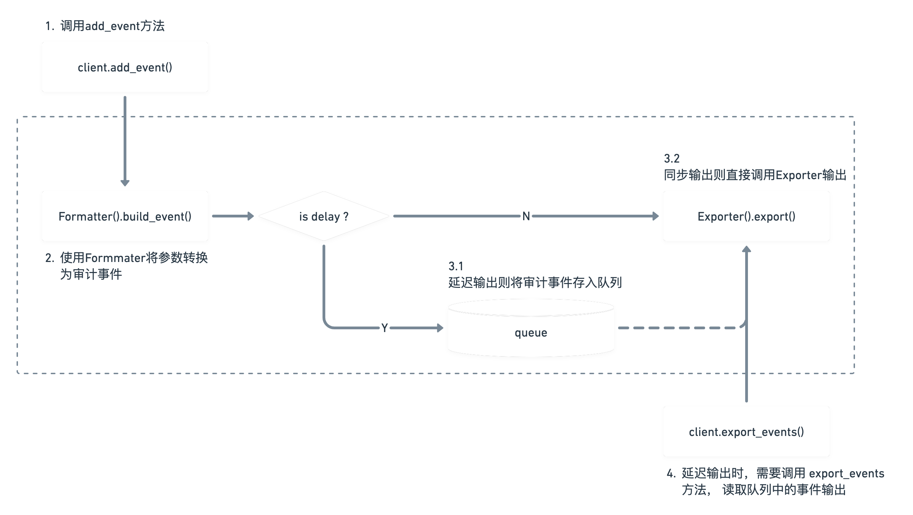

# BkAudit SDK

以下为 BkAudit SDK 使用说明文档，所有代码均有完整注释，可以在源码中查看。

## 类型说明

### 审计事件 AuditEvent

AuditEvent 定义了审计事件的标准字段，我们期望的审计事件由这些标准字段组成，详见 [bk_audit.log.models.AuditEvent](../bk_audit/log/models.py)

### 操作 Action

Action 实际上为 iam 模型中的 Action 对象，详见 [iam.model.models.Action](https://github.com/TencentBlueKing/iam-python-sdk/blob/master/iam/model/models.py)

### 资源类型 ResourceType

ResourceType 实际上为 iam 模型中的 ResourceType 对象，详见 [iam.model.models.ResourceType](https://github.com/TencentBlueKing/iam-python-sdk/blob/master/iam/model/models.py)

### 审计对象实例 AuditInstance

AuditInstance 定义了审计中传递实例需要的必须参数，会映射对应的字段到审计日志中，详见 [bk_audit.log.models.AuditInstance](../bk_audit/log/models.py)

### 审计上下文 AuditContext

上下文中定义了一个请求中常用且固定的参数，例如用户名，访问来源IP等信息，详见 [bk_audit.log.models.AuditContext](../bk_audit/log/models.py)

### 审计事件处理 Formatter

Formatter 用于将非标准化的参数或字段，转换为 AuditEvent 对象，详见 [bk_audit.log.formatters.Formatter](../bk_audit/log/formatters.py)

### 审计事件输出 Exporter

Exporter 用于输出审计事件，如输出到日志文件，OT Collector 等，详见 [bk_audit.log.exporters.LoggerExporter](../bk_audit/log/exporters.py)

## 数据流向

虚线框中的内容由 SDK 完成，用户只需要关心虚线框外的操作。



## 基本使用

以下以代码示例的方式进行说明，逐步完成整个SDK的配置与自定义，也可以参考 [example.main](../example/main.py) 的使用

### 初始化 Client

```python
from bk_audit.client import BkAudit

bk_audit_client = BkAudit(bk_app_code="APP_CODE", bk_app_secret="SECRET_KEY")
```

### 构造 Action 与 Resource

需要提前定义 Action 与 Resource 用于审计事件的生成

```python
from iam.model.models import Action, ResourceType

VIEW_FILE = Action(
    id="view-file",
    name=None,
    name_en=None,
    description=None,
    description_en=None,
    type=None,
    related_actions=None,
    related_resource_types=None,
    version=None
)
HOST = ResourceType(
    id="host",
    name=None,
    name_en=None,
    description=None,
    description_en=None,
    parents=None,
    provider_config=None,
    version=None
)
```

### 构造 AuditContext

```python
from bk_audit.log.models import AuditContext


# 用户对象 (Mock示例)
class User:
    username = "admin"


user = User()

# 构造上下文
context = AuditContext(username=user.username)
```

### 构造实例 AuditInstance

```python
from bk_audit.constants.log import DEFAULT_EMPTY_VALUE
from bk_audit.log.models import AuditInstance

data = {"id": 1, "name": "host-1"}


class HostInstance(object):
    def __init__(self, data):
        self.instance_id = data.get("id", DEFAULT_EMPTY_VALUE)
        self.instance_name = data.get("name", DEFAULT_EMPTY_VALUE)
        self.instance_data = data

    @property
    def instance(self):
        return AuditInstance(self)


instance = HostInstance(data)
```

### 输出 AuditEvent

```python
# 调用 client 的 add_event 方法添加审计事件
# add_event 函数的大部分参数都具有默认值，如果无法满足审计需求，请传入必要内容
bk_audit_client.add_event(action=VIEW_FILE, resource_type=HOST, audit_context=context, instance=instance)
```

需要注意的是，如果是输出到文件，需要确保文件每一行为一条审计事件，不能在外层再包裹其他内容，对于 Django 的 LOGGING 可以使用 `LoggingConfigHandler` 处理

```python
from bk_audit.contrib.django.loggers import LoggingConfigHandler

LOGGING = LoggingConfigHandler(filename="xxxx.log", log_level="INFO").set_logging(LOGGING)
```

## 使用进阶

### 自定义 Formatter

在参数传入后，会调用 Formatter 进行格式化与参数提取，得到一个 AuditEvent   
为了简便处理，对于一些在请求中比较固定的内容，可以直接传递给 audit_context，并在 Formatter 中处理   
例如，在 Django 项目中，可以注入 Request 对象

```python
from bk_audit.constants.log import DEFAULT_EMPTY_VALUE
from bk_audit.log.formatters import Formatter


class DjangoFormatter(Formatter):
    def build_event(
        self,
        audit_context,
        action,
        resource_type,
        instance,
        event_id,
        event_content,
        start_time,
        end_time,
        result_code,
        result_content,
        extend_data,
    ):
        # 尝试获取 Request 对象
        request = getattr(audit_context, "request", None)
        # 通过 Request 对象更新 AuditContext 传递的参数
        if request:
            audit_context.username = request.user.username
            audit_context.request_id = getattr(request, "request_id", DEFAULT_EMPTY_VALUE)
            audit_context.access_user_agent = request.META.get("HTTP_USER_AGENT", DEFAULT_EMPTY_VALUE)
        return super(DjangoFormatter, self).build_event(
            audit_context=audit_context,
            action=action,
            resource_type=resource_type,
            instance=instance,
            event_id=event_id,
            event_content=event_content,
            start_time=start_time,
            end_time=end_time,
            result_code=result_code,
            result_content=result_content,
            extend_data=extend_data,
        )
```

在定义好了 Formatter 后，需要更新 client

```python
# 方式一 (推荐)
bk_audit_client.set_formatter(DjangoFormatter())
# 方式二
bk_audit_client = BkAudit(
    bk_app_code="APP_CODE", bk_app_secret="SECRET_KEY", settings={"formatter": DjangoFormatter()}
)
```

此时我们在传递上下文时，就不需要传递 audit_context 中的所有参数，而是传递 Request 对象，在 Formatter 中进行提取补全

```python
request = object()  # Request 对象 (Mock示例)
context = AuditContext(request=request)
bk_audit_client.add_event(action=VIEW_FILE, resource_type=HOST, audit_context=context)
```

### 自定义 Exporter

审计事件默认会使用 logger(name=bk_audit) 输出，也可以定义自己的输出 Exporter   
is_delay 参数用于控制是否为同步输出   
若为 False，在 AuditEvent 产生后，立刻调用Exporter 输出   
若为 True，则需要在代码中调用 client.export_events 方法输出，这一部分会在后续内容介绍

```python
from bk_audit.log.exporters import BaseExporter


class ConsoleExporter(BaseExporter):
    is_delay = False

    def export(self, events):
        for event in events:
            print(event.to_json_str())
```

在定义好了 Exporter 后，需要更新 client

```python
# 方式一 (推荐)
bk_audit_client.add_exporter(ConsoleExporter())
# 方式二
bk_audit_client = BkAudit(
    bk_app_code="APP_CODE", bk_app_secret="SECRET_KEY", settings={"exporters": [ConsoleExporter()]}
)
```

当使用到了延迟输出的 Exporter 时(is_delay=True)，需要在代码中调用 export_events 方法输出   
例如，在 Django 项目中，使用了延迟 Exporter，此时可以在中间件中 process_response 时输出

```python
bk_audit_client.export_events()
```

需要注意的是，如果定义了 is_delay=True 但没有调用 export_events 方法，可能会导致内存不断增长，直到达到队列长度   
默认队列长度为10000，超出的内容会被清理，如果无法满足需求，可以手动设置队列的最大数量

```python
# 方式一 (推荐)
bk_audit_client.set_queue_limit(10000)
# 方式二
bk_audit_client = BkAudit(bk_app_code="APP_CODE", bk_app_secret="SECRET_KEY", settings={"log_queue_limit": 10000})
```

### 同步上报

默认的日志上报处理使用多线程的方式，对主线程无感知，若主线程提前退出可能导致日志丢失，若需要使用同步的方式上报，即等待日志上报成功再退出主线程，请添加如下环境变量

```shell
BKAPP_USE_SIMPLE_LOG_PROCESSOR=1
```

### Django 自动集成

在 Django 项目下，可在 INSTALLED_APPS 中增加 `bk_audit.contrib.bk_audit`，会通过 Django Settings 初始化对应的 bk_audit_client，在项目中可以直接使用

```python
# settings.py
# 所有配置均为可选配置
BK_AUDIT_SETTINGS = {
    "log_queue_limit": 50000,
    "formatter": "apps.audit.formatters.AuditFormatter",
    "exporters": ["bk_audit.contrib.opentelemetry.exporters.OTLogExporter"],
    "service_name_handler": "bk_audit.contrib.opentelemetry.utils.ServiceNameHandler",
    "ot_endpoint": "http://127.0.0.1:4317",
    "bk_data_token": "",
}
```

```python
from bk_audit.contrib.bk_audit.client import bk_audit_client

bk_audit_client.add_event(xxx)
```
